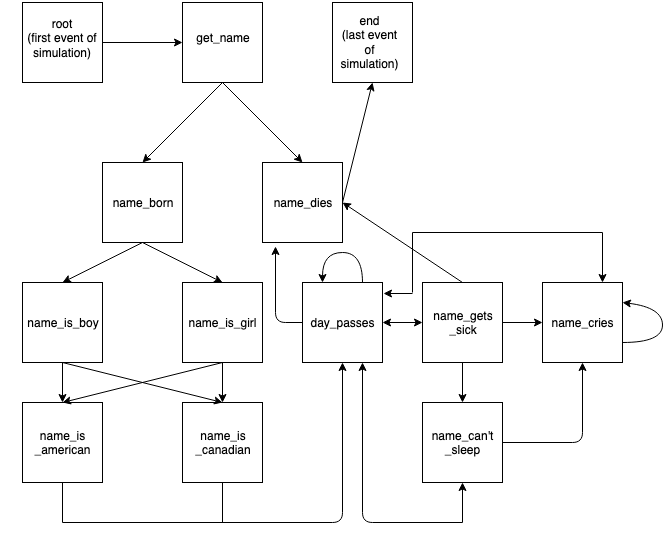

# Event Simulator

A module that allows the creation of a Markov chain-based simulations. It is designed to
make simulations where transitions between different states depend on weighted probabilities.

## Key Ideas

- **States** (which I'll also call **events**) are specified in a JSON file with a name, description, and list of **suffixes** (events that can happen afterwards).

- Each suffix is also labelled with a probability. For example, the event "walk_forward" might have two suffixes "walk_backward" and "walk_sideways", each labelled with a 50% probability of occurring.

- After importing the module, define a `start()`, `update()`, and `end()` function with custom code that is loaded when the sim runs. These functions must be packaged together into an object called a `SimKit`.

- `SimKit`s store all of the custom code for a simulation. For example, to simulate a person's life, you would create a `SimKit` with `start()`, `update()`, and `end()` functions that track the state of the person throughout the simulation.

- Any code in `start()` is run before any events in the sim occur; code in `update()` is called after each event occurs, and `end()` is called after the last event in the sim occurs.

- All three of these functions have access to a `data` dictionary. All three functions can freely add, read, and remove key/value pairs to this data structure.

- Typically, `start()` will initialize some key/value pairs to empty values or to zero, `update()` alters or adds to these values based on the type of event that occurs, and `end()` prints out a summary of the contents of the `data` dictionary. All of this code depends on what you want to simulate.

- In order to run a simulation, you must create an `Agent`. An `Agent` is an object that supervises a simulation, calling the `SimKit` functions at appropriate times and selecting the next event based on the probabilities given in JSON. Pass an `Agent` your `SimKit` object and call `agent.run()` (also passing an upper limit in the total number of events allowed).

## Examples

- Look through multiplication-sim.py and life-sim.py to get an idea on how to write custom code for a simulation. Their corresponding JSON files show all of the different states and their suffixes/probabilities.

### life-sim.py

A fairly simple simulation of a person's life, from birth until death.

*Flow chart of different states in life-sim.py*:

